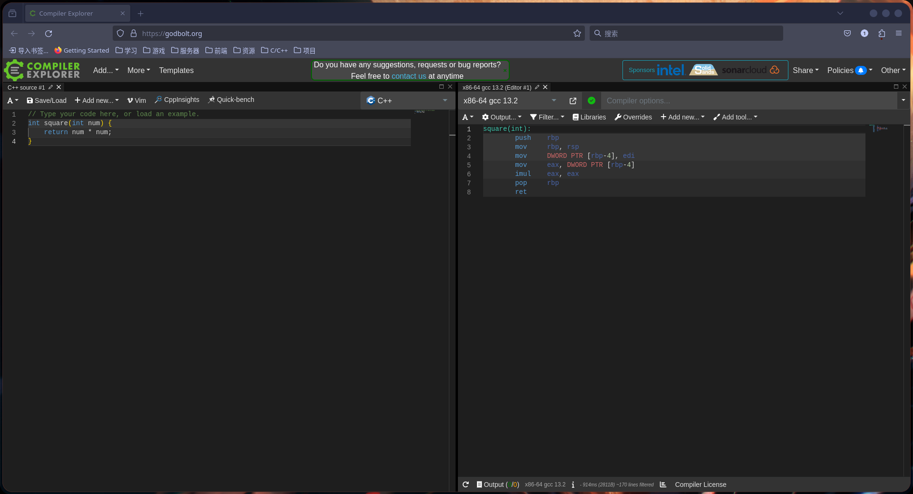
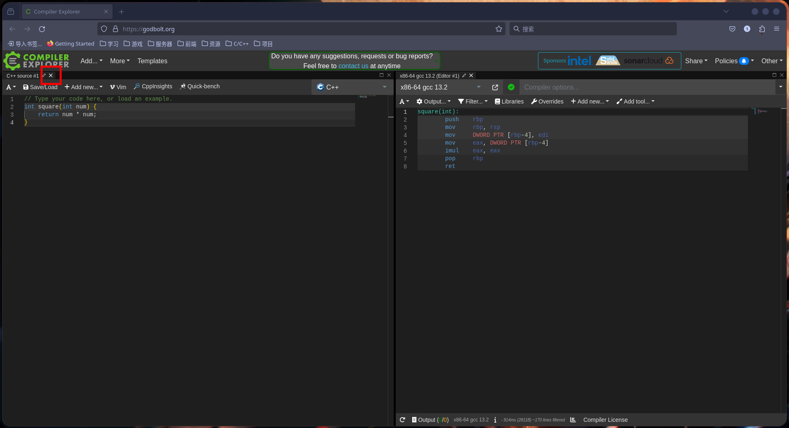
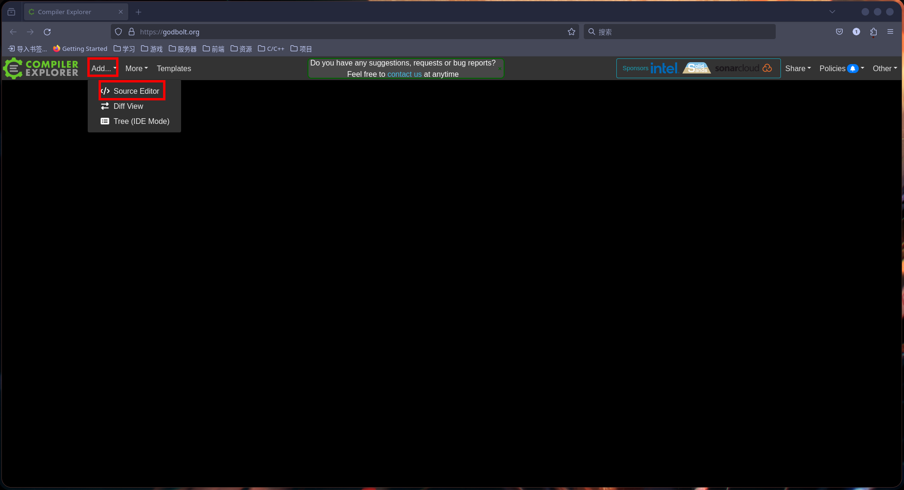
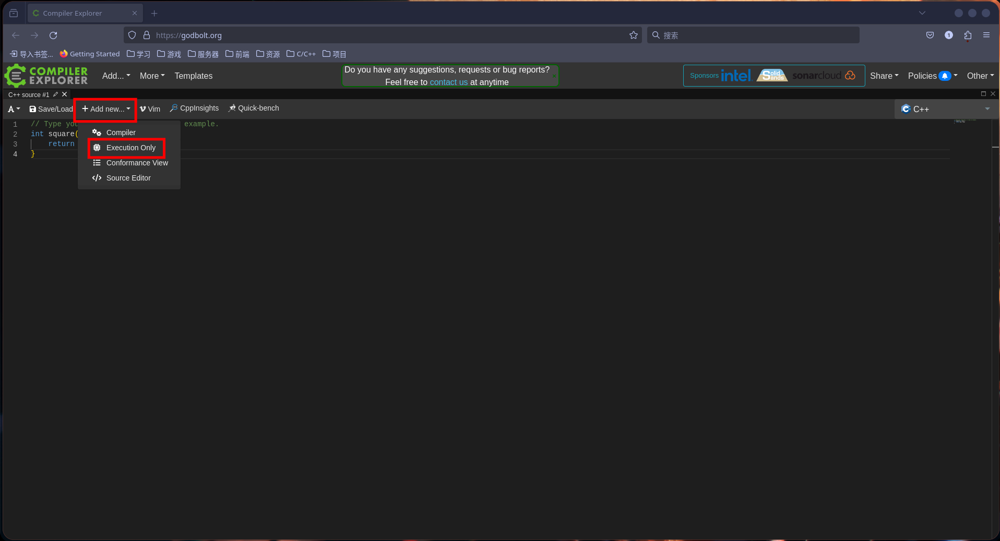
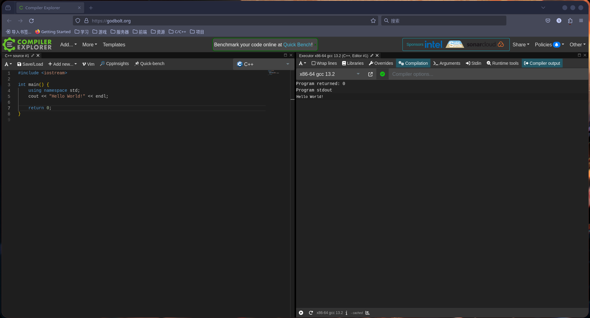

# 开发环境说明

---

## 流于表面 VS 深入理解

因为C语言的学习和后续单片机开发中所需要的工具不同，而配置方法也不尽相同，我们不希望表面地教学生如何配置开发环境，而是想教学开发环境背后的工作原理，让学生们能够自行配置开发环境。

<!-- TODO：完成环境说明 -->
但由于本课程时间的局限性，我们不可能在课堂上讲解开发环境原理，因此本章节将在课程结束后，以文档的形式发布。

课程中，我们将使用在线编译器[Godbolt](https://godbolt.org/)进行代码的编译和调试，这是一个非常好的在线编译器，它可以将你的C/C++代码编译成汇编代码，也可以在目标机器上运行你的代码，这对于我们理解C/C++代码的底层原理非常有帮助。

## Godbolt使用说明

单击链接，我们将进入Godbolt的主页，它的界面如下：

首先，我们关闭所有窗口，单击如下图所示的按钮：

点击`Add...`按钮，选择`Source Editor`唤出编辑器：

在新唤出的编辑器中，单击`Add new...`按钮，选择`Execution Only`：

现在，我们在左侧输入例程，右侧会实时显示运行结果：

这种方式简单快捷，但也有一些缺点，比如没有代码提示，只能单文件编译等，但对于我们的学习来说，已经足够了。

如果想要保存你的代码，可以点击`Save/Load`按钮，输入你的代码名称，然后点击`File System`按钮，最后选择`Save to file`即可。相应的，如果想读取你的代码，可以点击`Load from a local file`按钮，选择你的代码名称即可。
