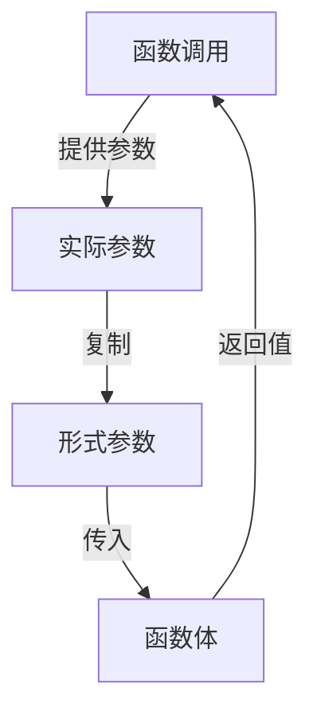

# 函数的参数传递

审视之前的`add`函数，我们声明了它有两个参数——`a`和`b`，他们的类型都是`int`。这里的`a`和`b`是函数的形式参数，也就是说，他们只在函数内部有效。

而在函数调用的时候，我们传入的参数`x`和`y`，他们是函数的实际参数，也就是说，他们是真正的数据。

在参数由实际参数传递给形式参数的过程中，`x`和`y`的值被复制到了`a`和`b`中，这种参数传递方式称为值传递。

值传递导致了我么在函数中获得的参数与函数调用时传入的参数是完全独立的，也就是说，我们在函数中修改参数的值并不会影响到函数调用时传入的参数。

如果想让函数修改函数调用时传入的参数，我们需要使用引用或指针类型。

::right::

