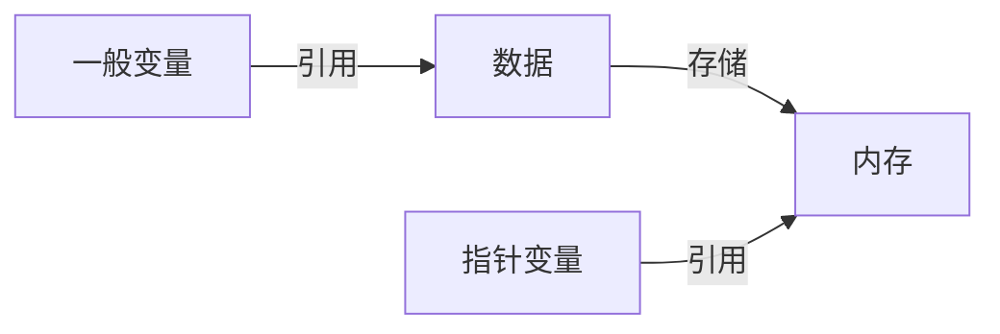

# 指针的定义

我们之间花很大的篇幅介绍了各种 C 语言和 C++语言的数据类型，指针类型是一种特殊的数据类型，它用来存储一个变量的地址。

在创建一个变量的时候，编译器会自动地为这个变量分配一块内存，然后把变量本身绑定给一个符号（变量名），因此，我们可以认为一般变量是对内存的直接引用，而指针类型是对该变量所在内存地址的引用。

> 内存地址是一个无符号整数，它表示内存中的一个位置。在 32 位系统中，一个内存地址通常是一个 32 位的整数，而在 64 位系统中，一个内存地址通常是一个 64 位的整数。

